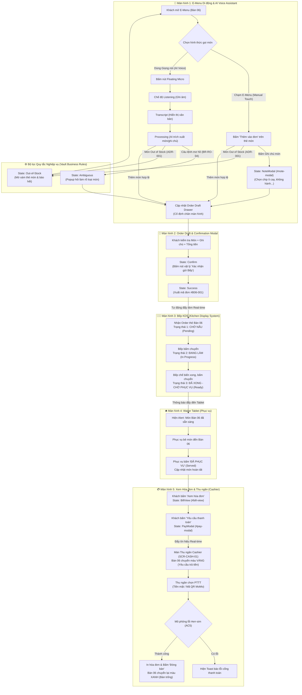
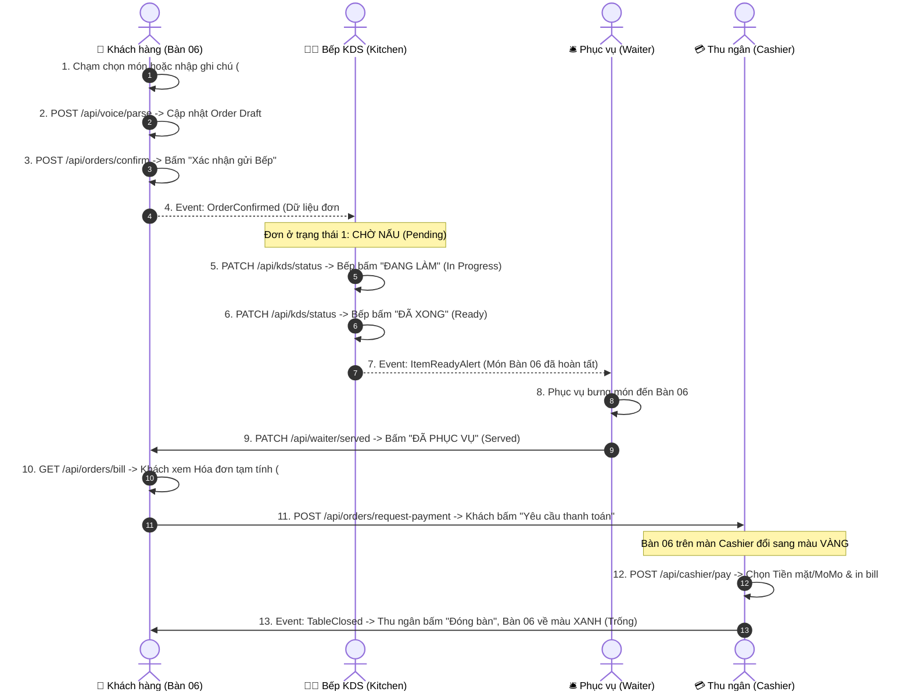

# Screen Flow Architecture - Group 06 (Restaurant Operations & Smart Ordering)

> **Tài liệu**: Sơ đồ Kiến trúc Luồng Màn hình & Trạng thái UI cho ứng dụng  
> **Phiên bản**: 2.0 (Cập nhật chuẩn theo các màn hình `frontend/fe_ofc/` - E-Menu, Order Draft, KDS, Waiter & Cashier)  
> **Tác giả**: Lê Thị Thanh Nhàn (Role UX/UI Designer & AI/Vault Master)  

---

## 1. SƠ ĐỒ LUỒNG CHUYỂN MÀN HÌNH TỔNG THỂ (END-TO-END SCREEN FLOW)

Sơ đồ Mermaid dưới đây thể hiện trọn vẹn luồng di chuyển từ Khách gọi món trên điện thoại $\rightarrow$ Bếp KDS xử lý 3 trạng thái $\rightarrow$ Phục vụ dọn món $\rightarrow$ Khách xem hóa đơn & Thu ngân thanh toán đóng bàn.

---

## 2. CÁC ĐIỂM GỌI API & SỰ KIỆN REAL-TIME (SIMULATED API ENDPOINTS)

Dưới đây là chuỗi tương tác API và sự kiện real-time đầy đủ giữa Khách hàng, Bếp KDS, Phục vụ và Thu ngân:

