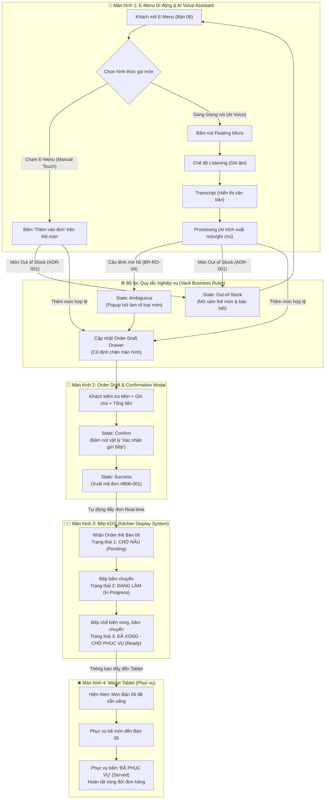
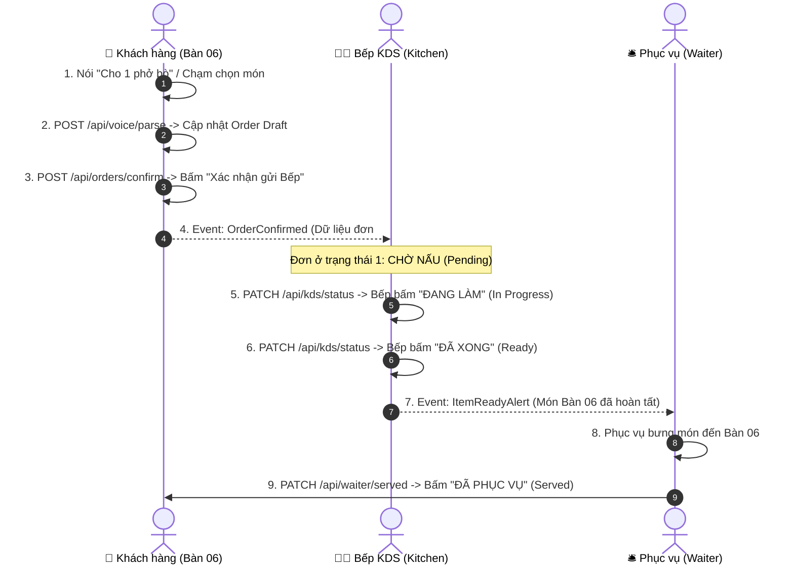

# Screen Flow Architecture - Group 06 (Restaurant Operations & Smart Ordering)

> **Tài liệu**: Sơ đồ Kiến trúc Luồng Màn hình & Trạng thái UI (Screen & State Transitions)  
> **Phiên bản**: 1.0 (Giai đoạn 3 - Prototype Design)  
> **Tác giả**: Lê Thị Thanh Nhàn (Role UX/UI Designer & AI/Vault Master)  

---

## 1. SƠ ĐỒ LUỒNG CHUYỂN MÀN HÌNH TỔNG THỂ (END-TO-END SCREEN FLOW)

Sơ đồ Mermaid dưới đây thể hiện trọn vẹn luồng di chuyển từ Khách gọi món trên điện thoại $\rightarrow$ Bếp KDS xử lý 3 trạng thái $\rightarrow$ Phục vụ dọn món tại bàn.

---

## 2. MA TRẬN VỊ TRÍ HIỂN THỊ 10 TRẠNG THÁI UI (10 REQUIRED UI STATES MAPPING)

| # | Trạng thái (UI State) | Màn hình xuất hiện | Điều kiện kích hoạt (Trigger Condition) | Hành vi UI & Phản hồi hệ thống |
| :---: | :--- | :--- | :--- | :--- |
| 1 | **`idle`** | Screen 1 (E-Menu) | Khách mới mở trang web hoặc chưa tương tác. | E-Menu hiển thị danh sách món ăn ở trạng thái bình thường. Nút Micro ở chế độ sẵn sàng. |
| 2 | **`listening`** | Screen 1 (Voice Modal) | Khách bấm giữ/nhấp vào nút Micro gọi món. | Nút Micro sáng xanh nhấp nháy, hiển thị sóng âm đang thu tiếng nói của khách. |
| 3 | **`processing`** | Screen 1 (Voice Modal) | Khách ngưng nói, hệ thống gửi âm thanh đến AI. | Spinner xoay tròn kèm dòng chữ *"AI đang phân tích câu lệnh của bạn..."*. |
| 4 | **`ambiguous`** | Screen 1 (Clarification) | Khách nói câu lệnh chung chung *"Cho 1 đĩa bò"* (`BR-RO-04`). | Bật Popup làm rõ: *"Nhà hàng có Bò xào cần (85k) và Bò sốt tiêu đen (120k), bạn chọn loại nào?"*. |
| 5 | **`out-of-stock`** | Screen 1 & Screen 2 | Khách chọn món có trạng thái hết hàng (`ADR-001`). | Thẻ món tự động mờ xám (*Grayed-out*), khóa nút bấm, AI đọc thông báo và gợi ý món khác. |
| 6 | **`order-draft`** | Screen 2 (Order Draft) | Sau khi thêm ít nhất 1 món ăn hợp lệ. | Cửa sổ giỏ hàng trượt từ dưới lên (Drawer), hiển thị món, số lượng, ghi chú "không hành", tổng tiền. |
| 7 | **`empty`** | Screen 2 (Order Draft) | Giỏ hàng chưa có món nào hoặc khách xóa hết món. | Hiển thị hình minh họa giỏ hàng trống kèm nút *"Khám phá Menu"*. |
| 8 | **`confirm`** | Screen 2 (Confirmation) | Khách xem giỏ hàng và chuẩn bị chốt đơn. | Nút bấm vật lý **"Xác nhận gửi Bếp"** sáng nổi bật (Primary Action) để người dùng bấm trực tiếp. |
| 9 | **`success`** | Screen 1 & 2 & 3 | Sau khi khách bấm nút "Xác nhận gửi Bếp". | Bật Popup thành công *"Đã gửi đơn xuống Bếp (#B06-001)"*, giỏ hàng làm sạch, đẩy thẻ đơn sang Bếp KDS. |
| 10 | **`network-error`** | Toàn bộ ứng dụng | Mất kết nối internet / Server KDS không phản hồi. | Thanh thông báo màu đỏ hiển thị trên cùng *"Mất kết nối mạng. Đơn hàng sẽ được lưu offline"*. |

---

## 3. CÁC ĐIỂM GỌI API GIẢ LẬP (SIMULATED API ENDPOINTS)

Dưới đây là các điểm dữ liệu trao đổi giữa các màn hình di động, Bếp KDS và Phục vụ được giả lập trong ứng dụng Web Prototype:

