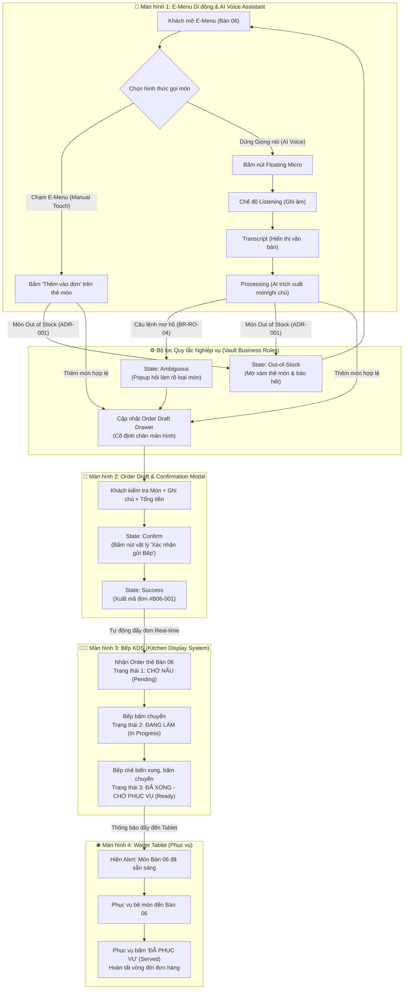
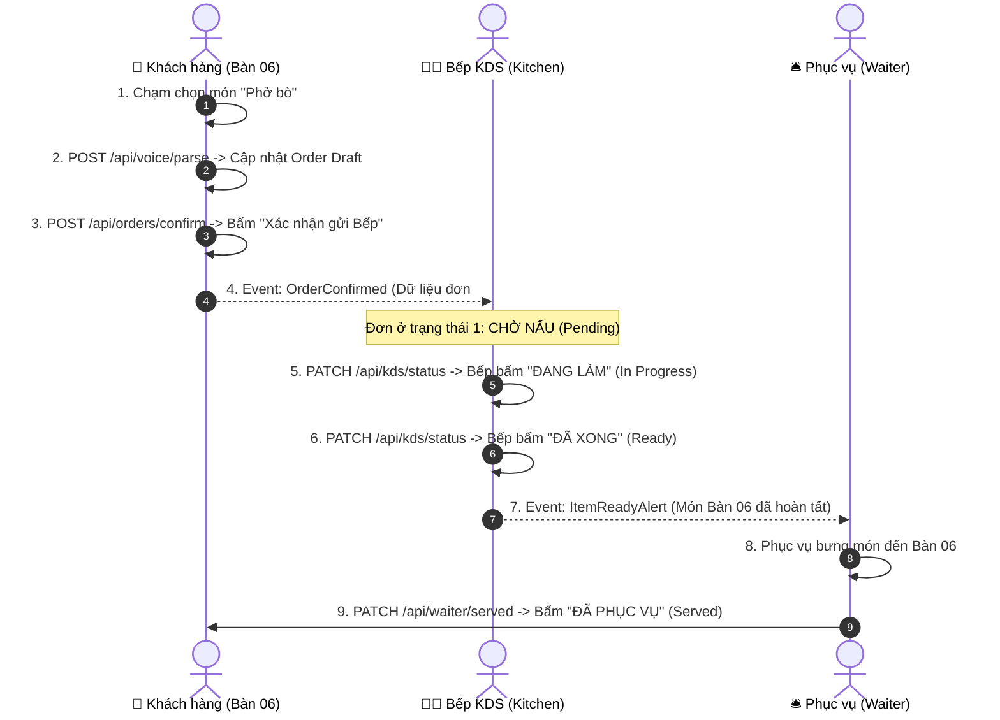

# Screen Flow Architecture - Group 06 (Restaurant Operations & Smart Ordering)

> **Tài liệu**: Sơ đồ Kiến trúc Luồng Màn hình & Trạng thái UI cho prototype  
> **Phiên bản**: 1.0 (Giai đoạn 3 - Prototype Design)  
> **Tác giả**: Lê Thị Thanh Nhàn (Role UX/UI Designer & AI/Vault Master)  

---

## 1. SƠ ĐỒ LUỒNG CHUYỂN MÀN HÌNH TỔNG THỂ (END-TO-END SCREEN FLOW)

Sơ đồ Mermaid dưới đây thể hiện trọn vẹn luồng di chuyển từ Khách gọi món trên điện thoại $\rightarrow$ Bếp KDS xử lý 3 trạng thái $\rightarrow$ Phục vụ dọn món tại bàn.

---

## 3. CÁC ĐIỂM GỌI API GIẢ LẬP (SIMULATED API ENDPOINTS)

Dưới đây là các điểm dữ liệu trao đổi giữa các màn hình di động, Bếp KDS và Phục vụ được giả lập trong ứng dụng Web Prototype:

