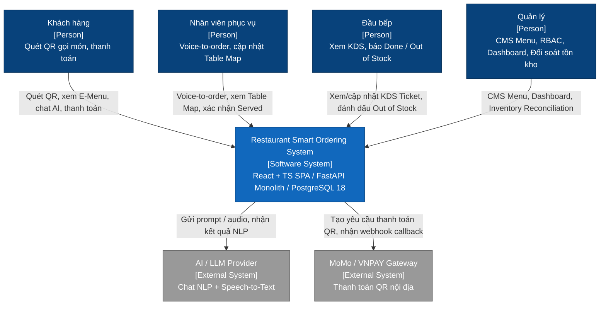
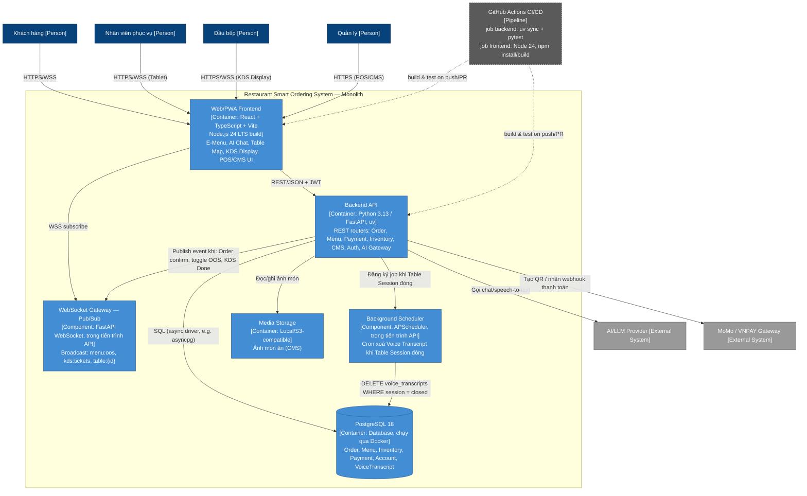

# Architecture — Restaurant Smart Ordering System

> Model: C4 (Level 1 System Context, Level 2 Container). Vai trò: System Architect.
> Nguồn tham chiếu: `vault/01-Requirements/requirements.md`, `vault/04-User-Stories/user-stories.md`, `vault/01-Requirements/glossary.md`, `docs/03-Product/user-flow.mmd`, `vault/08-Decisions/decision-log.md` (ADR-001 gốc — xử lý OOS trong Order Draft), `vault/01-Requirements/scope.md`.

## 1. Môi trường chuẩn (Standard Environment — bắt buộc tuân thủ)

| Layer | Công nghệ | Phiên bản | Ghi chú |
|---|---|---|---|
| Frontend runtime | **Node.js** | **24 LTS** | Build tool cho React app |
| Frontend framework | **React + TypeScript** | — | SPA/PWA, route/UI gated theo role (Guest, Waiter, Kitchen, Manager) |
| Frontend bundler | **Vite** | — | Dev server + build, thay CRA |
| Backend runtime | **Python** | **3.13.x** | Đã đồng bộ `backend/.python-version` = `3.13`, `pyproject.toml` `requires-python = ">=3.13"` |
| Backend framework | **FastAPI** | — | Native async + native WebSocket, phù hợp yêu cầu real-time OOS/KDS |
| Backend package manager | **uv** | — | `backend/uv.lock` |
| Database | **PostgreSQL** | **18** (qua Docker) | Service `db` trong `compose.yaml`, image `postgres:18-alpine` |
| CI/CD | **GitHub Actions** | — | `.github/workflows/ci.yml`: job `backend` (uv sync + pytest), job `frontend` (Node 24, npm install/build) |
| Realtime | **WebSocket Pub/Sub** (FastAPI, in-process) | — | Đồng bộ Out of Stock (REQ-09) và Kitchen Ticket (REQ-08) |
| Scheduler | **APScheduler** (trong tiến trình FastAPI) | — | Xoá cứng Voice Transcript khi Table Session kết thúc (NFR-RO-02) |
| Payment | Adapter nội địa: **MoMo API**, **VNPAY API**, **Cash (thủ công)** | — | Theo REQ-04, ADR-ARCH-002 |
| AI | Gọi ra **AI/LLM Provider** (Chat NLP + Speech-to-Text) qua AI Gateway trong backend | — | REQ-01, REQ-05 |

## 2. System Context (C4 Level 1)



## 3. Container Diagram (C4 Level 2)



## 4. WebSocket Pub/Sub bằng FastAPI — đồng bộ Out of Stock & Kitchen Ticket

**Kênh (channel):**
- `menu:oos` — broadcast toàn hệ thống mỗi khi một Menu Item đổi trạng thái Out of Stock (REQ-09). Mọi client đang mở (E-Menu của khách, Tablet phục vụ, KDS) subscribe kênh này.
- `kds:tickets` — broadcast khi có Kitchen Ticket mới, đổi trạng thái (Cooking/Done), hoặc chuyển Overdue sau 15 phút (REQ-08).
- `table:{table_session_id}` — kênh riêng theo bàn, đẩy sự kiện Order Draft bị khoá do món OOS (REQ-15/ADR-001 gốc trong `decision-log.md`) và thông báo "Ting Ting" khi món Done (US-04).

**Cơ chế kỹ thuật (FastAPI native WebSocket, không cần broker ngoài ở quy mô MVP):**

```python
# app/ws/manager.py
from collections import defaultdict
from fastapi import WebSocket, WebSocketDisconnect

class ConnectionManager:
    def __init__(self) -> None:
        self.channels: dict[str, set[WebSocket]] = defaultdict(set)

    async def connect(self, channel: str, ws: WebSocket) -> None:
        await ws.accept()
        self.channels[channel].add(ws)

    def disconnect(self, channel: str, ws: WebSocket) -> None:
        self.channels[channel].discard(ws)

    async def broadcast(self, channel: str, message: dict) -> None:
        for ws in list(self.channels[channel]):
            try:
                await ws.send_json(message)
            except WebSocketDisconnect:
                self.disconnect(channel, ws)

manager = ConnectionManager()
```

```python
# app/ws/router.py
from fastapi import APIRouter, WebSocket, WebSocketDisconnect
from app.ws.manager import manager

router = APIRouter()

@router.websocket("/ws/{channel}")
async def ws_endpoint(websocket: WebSocket, channel: str):
    await manager.connect(channel, websocket)
    try:
        while True:
            await websocket.receive_text()  # keep-alive / ping từ client
    except WebSocketDisconnect:
        manager.disconnect(channel, websocket)
```

**Luồng OOS (REQ-09 + REQ-15):**
1. Kitchen/Manager gọi `POST /menu/items/{id}/out-of-stock`.
2. API cập nhật `Menu Item.status = OUT_OF_STOCK` trong PostgreSQL, sau đó `await manager.broadcast("menu:oos", {...})`.
3. WS Gateway đẩy realtime tới mọi client đang mở; đồng thời broadcast thêm tới `table:{id}` cho các bàn đang có món đó trong Order Draft chưa confirm → SPA tự động grayed-out món + disable nút Explicit Confirmation.

**Luồng KDS (REQ-08):**
1. `POST /orders/confirm` tạo Kitchen Ticket, `await manager.broadcast("kds:tickets", {...})`.
2. KDS Display nhận realtime, hiển thị ticket theo thời gian; một job định kỳ (chạy trong `SCHED`, ví dụ mỗi 30 giây) quét ticket quá 15 phút, đánh dấu Overdue rồi broadcast lại `kds:tickets` để re-sort ưu tiên.

**Giới hạn đã biết:** `ConnectionManager` giữ state in-memory trong 1 tiến trình — đúng với ADR-ARCH-001 (Monolith, 1 instance). Nếu scale-out nhiều instance backend, cần thay bằng Redis Pub/Sub hoặc Postgres `LISTEN/NOTIFY`.

## 5. Background Job/Cron — xoá Voice Transcript (NFR-RO-02)

**Cơ chế kỹ thuật (APScheduler chạy trong FastAPI lifespan, không cần cron OS riêng):**

```python
# app/scheduler.py
from contextlib import asynccontextmanager
from apscheduler.schedulers.asyncio import AsyncIOScheduler
from fastapi import FastAPI
from app.jobs.voice_cleanup import purge_closed_session_transcripts

scheduler = AsyncIOScheduler()

@asynccontextmanager
async def lifespan(app: FastAPI):
    scheduler.add_job(purge_closed_session_transcripts, "interval", minutes=5)
    scheduler.start()
    yield
    scheduler.shutdown()

app = FastAPI(lifespan=lifespan)
```

- **Trigger 1 (chính xác, ưu tiên):** khi Table Session chuyển sang `closed` (sau khi thanh toán thành công và bàn được đóng — theo `user-flow.mmd` bước "Đóng bàn"), endpoint `POST /tables/{id}/close` gọi trực tiếp `purge_closed_session_transcripts(session_id=...)` ngay lập tức, không chờ job định kỳ.
- **Trigger 2 (an toàn dự phòng):** job `interval, minutes=5` ở trên quét mọi `voice_transcripts` có `table_session.status = closed` mà vì lý do nào đó chưa bị xoá ở Trigger 1 (crash, lỗi transient).
- **Hành vi xoá:** `DELETE` cứng (hard delete) bản ghi + file audio thô liên quan trong Media Storage — không soft-delete, không giữ bản sao lưu, đúng yêu cầu "không lưu trữ vĩnh viễn" của NFR-RO-02.
- **Phạm vi dữ liệu KHÔNG bị xoá:** transcript đã được AI tóm tắt thành Order Item (dữ liệu nghiệp vụ) không nằm trong phạm vi job này — chỉ xoá file/bản ghi âm thanh thô.

## 6. Architecture Decision Records

### ADR-ARCH-001: Chọn kiến trúc Monolith cho Backend (thay vì Microservices)

- **Ngày quyết định:** 2026-09-04
- **Người quyết định:** System Architect (theo yêu cầu trực tiếp của nhóm)
- **Bối cảnh:** Team nhỏ (sinh viên), 1 backend dev chính, thời gian một học kỳ, quy mô vận hành MVP cho 1 nhà hàng. Hạ tầng CI/CD dùng **GitHub Actions** với 2 job đơn giản (backend, frontend) trong 1 file `.github/workflows/ci.yml` — mô hình Microservices sẽ đòi hỏi nhiều pipeline, nhiều registry image, nhiều bộ secrets, vượt quá năng lực vận hành CI/CD hiện tại của nhóm. Các domain nghiệp vụ (Order, Inventory, KDS, Payment) có quan hệ giao dịch chặt — ví dụ Order confirm cần trừ tồn kho trong cùng transaction.
- **Quyết định:** Xây dựng Backend dưới dạng **Modular Monolith** bằng FastAPI — một tiến trình/deployable duy nhất, tách theo router/module nội bộ (Order, Menu, Payment, Inventory, CMS, Auth, AI Gateway, WebSocket Gateway, Scheduler), thay vì Microservices.
- **Lý do:**
  - Transaction xuyên domain (VD: confirm Order → trừ Inventory → publish WS) thực hiện được trong 1 DB transaction ACID, tránh distributed transaction/saga phức tạp không cần thiết ở quy mô này.
  - Giảm chi phí vận hành: không cần API Gateway, service discovery, distributed tracing, message broker riêng.
  - **Khớp trực tiếp với môi trường CI/CD GitHub Actions hiện có**: 1 codebase → 1 workflow, 2 job (`backend`, `frontend`) build/test trên mỗi push/PR, 1 artifact/image để deploy — không cần orchestrate nhiều pipeline độc lập cho từng service.
  - Vẫn tách rõ module theo router để dễ bóc tách thành service riêng sau này nếu quy mô tăng (nhiều chi nhánh, tải cao).
- **Hệ quả:**
  - (+) Deploy đơn giản, khớp `compose.yaml` hiện có (chỉ cần thêm 1 service `backend`).
  - (+) 1 workflow GitHub Actions duy nhất, thời gian CI ngắn, dễ maintain cho team nhỏ.
  - (+) Debug/local dev nhanh, không có độ trễ mạng nội bộ giữa các module.
  - (-) Không scale độc lập từng module (ví dụ AI Gateway tốn tài nguyên hơn Payment) — chấp nhận đánh đổi này ở MVP, đánh giá lại nếu mở rộng nhiều nhà hàng.
  - (-) Pub/Sub in-memory (Mục 4) chỉ đúng khi chạy 1 instance backend; cần thay Redis/`LISTEN-NOTIFY` nếu scale-out nhiều instance.
- **Trạng thái:** Accepted.

### ADR-ARCH-002: Chỉ dùng Payment Adapter nội địa (MoMo/VNPAY) + Tiền mặt

- **Ngày quyết định:** 2026-09-04
- **Người quyết định:** System Architect (theo yêu cầu trực tiếp của nhóm, khớp quyết định scope đã duyệt tại `vault/01-Requirements/scope.md`)
- **Bối cảnh:** REQ-04 yêu cầu thanh toán QR MoMo/VNPAY tại bàn. REQ-14 (tích hợp Stripe/Visa/Mastercard) đã được đánh dấu **Out of Scope** trong `vault/01-Requirements/scope.md` vì chi phí tích hợp cao và quy trình đối soát phức tạp so với quy mô hiện tại.
- **Quyết định:** Module Payment chỉ triển khai 2 adapter: **MoMo API**, **VNPAY API**, cộng thêm luồng **Cash fallback** (ghi nhận thủ công tại quầy khi lỗi cổng ngân hàng — theo nhánh lỗi trong `user-flow.mmd`). Không tích hợp cổng thanh toán quốc tế trong MVP.
- **Lý do:**
  - Đúng theo quyết định scope đã duyệt (REQ-14 Out of Scope) — không tạo Scope Creep.
  - Khách hàng mục tiêu thanh toán tại bàn chủ yếu bằng ví điện tử nội địa quét QR (theo phỏng vấn Chị Lan — P2).
  - Tích hợp thẻ quốc tế (Stripe/Visa/Mastercard) đòi hỏi PCI-DSS compliance và hồ sơ doanh nghiệp phức tạp hơn nhiều so với MoMo/VNPAY Business — vượt nguồn lực và thời gian của nhóm.
  - Thiết kế module Payment theo interface `PaymentGateway` chung (Adapter Pattern) — nếu tương lai cần thêm cổng quốc tế, chỉ cần viết thêm 1 adapter mới, không đổi core logic Order/Invoice/Split Bill.
- **Hệ quả:**
  - (+) Giảm rủi ro bảo mật và chi phí compliance ở giai đoạn MVP.
  - (+) Khớp đúng quyết định scope đã duyệt, không cần xin duyệt lại.
  - (-) Không phục vụ được khách quốc tế dùng thẻ Visa/Mastercard — đánh đổi đã được chấp nhận tại `scope.md`.
- **Trạng thái:** Accepted.

> **Đánh số ADR:** 2 ADR kiến trúc ở trên dùng tiền tố riêng `ADR-ARCH-*` để không trùng mã với `vault/08-Decisions/decision-log.md` (nơi giữ các ADR nghiệp vụ, ví dụ `ADR-001` — xử lý món Out of Stock trong Order Draft). Hai dãy số độc lập theo phạm vi tài liệu: `ADR-ARCH-*` cho quyết định kiến trúc/kỹ thuật (`architecture.md`), `ADR-*` cho quyết định nghiệp vụ (`decision-log.md`).

## 7. Đồng bộ với cấu hình thực tế trong repo

Để tài liệu này khớp 100% với môi trường chuẩn, các file cấu hình sau đã được cập nhật cùng lúc:
- `backend/.python-version`: `3.12` → **`3.13`**
- `backend/pyproject.toml`: `requires-python = ">=3.12"` → **`">=3.13"`**
- `.github/workflows/ci.yml`: `actions/setup-node` `node-version: 20` → **`24`**
