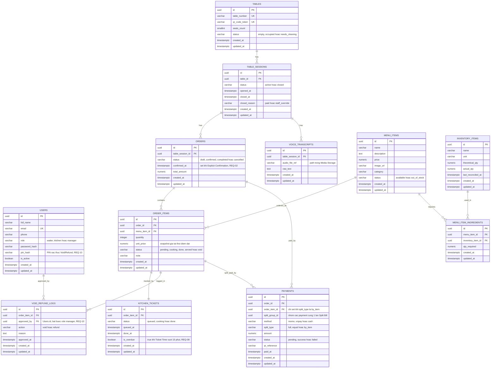

# Data Model — Restaurant Smart Ordering System (PostgreSQL 18)

> Vai trò: System Architect. ERD hỗ trợ PostgreSQL 18, dùng `uuid` (mở rộng `pgcrypto`/`gen_random_uuid()`) làm khóa chính để tránh lộ số thứ tự đơn hàng qua QR/URL.
> Nguồn tham chiếu: `vault/06-Engineering/architecture.md`, `vault/01-Requirements/requirements.md`, `vault/04-User-Stories/user-stories.md`, `vault/01-Requirements/glossary.md`.

## 1. ERD (Mermaid)



## 2. Bảng tổng hợp Foreign Keys

| Bảng con | Cột FK | Tham chiếu | ON DELETE | Ghi chú |
|---|---|---|---|---|
| `table_sessions` | `table_id` | `tables.id` | RESTRICT | 1 bàn có nhiều session theo thời gian |
| `voice_transcripts` | `table_session_id` | `table_sessions.id` | RESTRICT (xoá bằng trigger, không cascade — xem Mục 4) | Không cascade vì `table_sessions` không bao giờ bị xoá |
| `orders` | `table_session_id` | `table_sessions.id` | RESTRICT | 1 session có 1 Order chính (draft → confirmed) |
| `order_items` | `order_id` | `orders.id` | CASCADE | Xoá Order nháp chưa confirm thì xoá luôn item con |
| `order_items` | `menu_item_id` | `menu_items.id` | RESTRICT | Không cho xoá Menu Item đã từng được đặt (giữ lịch sử) |
| `menu_item_ingredients` | `menu_item_id` | `menu_items.id` | CASCADE | Xoá món thì xoá công thức nguyên liệu liên quan |
| `menu_item_ingredients` | `inventory_item_id` | `inventory_items.id` | RESTRICT | Không xoá nguyên liệu đang được dùng trong công thức |
| `kitchen_tickets` | `order_item_id` | `order_items.id` | CASCADE, UNIQUE | Quan hệ 1–1: mỗi Order Item đúng 1 Kitchen Ticket |
| `payments` | `order_id` | `orders.id` | RESTRICT | Giữ lịch sử giao dịch dù order đã completed |
| `payments` | `order_item_id` | `order_items.id` | RESTRICT (nullable) | Chỉ set khi `split_type = by_item` |
| `void_refund_logs` | `order_item_id` | `order_items.id` | RESTRICT | Log không bao giờ bị xoá (đối soát chống gian lận) |
| `void_refund_logs` | `approved_by` | `users.id` | RESTRICT | Bắt buộc là tài khoản role `manager` (kiểm tra ở tầng ứng dụng, RBAC REQ-10) |

**Bảng bổ sung ngoài danh sách bắt buộc:** `voice_transcripts` (cần thiết để Table_Sessions có nội dung thực sự phải hard-delete theo NFR-RO-02) và `menu_item_ingredients` (bảng nối N–N giữa Menu_Items ↔ Inventory_Items, cần thiết để tự động trừ kho / kích hoạt Out of Stock — REQ-09, REQ-12). Nếu muốn giữ đúng 10 bảng tuyệt đối, có thể gộp `menu_item_ingredients` thành cột JSONB trong `menu_items`, nhưng sẽ mất khả năng truy vấn quan hệ chuẩn (đánh đổi không khuyến nghị).

## 3. Audit fields — quy ước chung

Tất cả 12 bảng đều có:
- `id UUID PRIMARY KEY DEFAULT gen_random_uuid()` — cần bật extension `pgcrypto` (`CREATE EXTENSION IF NOT EXISTS pgcrypto;`), có sẵn trong PostgreSQL 18.
- `created_at TIMESTAMPTZ NOT NULL DEFAULT now()`
- `updated_at TIMESTAMPTZ NOT NULL DEFAULT now()`, tự động cập nhật bằng trigger dùng chung:

```sql
CREATE OR REPLACE FUNCTION set_updated_at()
RETURNS TRIGGER AS $$
BEGIN
    NEW.updated_at = now();
    RETURN NEW;
END;
$$ LANGUAGE plpgsql;

-- Áp dụng cho từng bảng, ví dụ với orders:
CREATE TRIGGER trg_orders_updated_at
BEFORE UPDATE ON orders
FOR EACH ROW EXECUTE FUNCTION set_updated_at();
```

## 4. Cơ chế Hard-delete cho Table_Sessions theo NFR-RO-02

**Nguyên tắc quan trọng:** NFR-RO-02 yêu cầu xoá **file/transcript âm thanh thô**, chứ không xoá bản thân bản ghi `table_sessions` — `table_sessions` vẫn phải tồn tại vĩnh viễn vì là dữ liệu lịch sử phục vụ Dashboard doanh thu (REQ-13), truy vết Order/Payment. Vì vậy đối tượng bị hard-delete là các dòng trong bảng `voice_transcripts`, không phải cascade xoá `table_sessions`.

**2 lớp bảo vệ (defense-in-depth), khớp thiết kế Background Job đã mô tả ở `architecture.md`:**

1. **Tầng ứng dụng (chính):** khi endpoint `POST /tables/{id}/close` chuyển `table_sessions.status = 'closed'`, backend gọi ngay job xoá transcript của session đó + xoá file audio tương ứng trong Media Storage (DB không xoá được file ngoài, nên bước này bắt buộc ở tầng app).
2. **Tầng database (lưới an toàn, đảm bảo dù tầng app lỗi vẫn không rò rỉ dữ liệu):** trigger Postgres tự xoá cứng dòng `voice_transcripts` ngay khi `status` chuyển sang `closed`:

```sql
CREATE OR REPLACE FUNCTION purge_voice_transcripts_on_session_close()
RETURNS TRIGGER AS $$
BEGIN
    IF NEW.status = 'closed' AND OLD.status IS DISTINCT FROM 'closed' THEN
        DELETE FROM voice_transcripts WHERE table_session_id = NEW.id;
    END IF;
    RETURN NEW;
END;
$$ LANGUAGE plpgsql;

CREATE TRIGGER trg_purge_voice_transcripts
AFTER UPDATE OF status ON table_sessions
FOR EACH ROW
EXECUTE FUNCTION purge_voice_transcripts_on_session_close();
```

3. **Lưới an toàn thứ 3 (định kỳ, xử lý session bị treo):** job APScheduler (Mục 5, `architecture.md`) quét mỗi 5 phút, xoá mọi `voice_transcripts` mà `table_session.status = 'closed'` nhưng chưa bị xoá — bắt các trường hợp session đóng do lỗi/crash không qua đúng luồng `POST /tables/{id}/close`.

**Vì sao không dùng `ON DELETE CASCADE` trên FK `voice_transcripts.table_session_id`:** CASCADE chỉ kích hoạt khi `table_sessions` bị `DELETE`, nhưng `table_sessions` không bao giờ bị xoá (cần giữ vĩnh viễn cho lịch sử/đối soát) — nên phải dùng trigger theo sự kiện `UPDATE status` như trên, không thể dựa vào cascade.

**Giới hạn còn lại:** trigger DB chỉ đảm bảo xoá **bản ghi + text transcript** trong Postgres; file audio thô nằm ở Media Storage (ngoài DB) vẫn phụ thuộc tầng ứng dụng dọn dẹp — nên Trigger 1 (tầng ứng dụng) trong `architecture.md` vẫn là bước bắt buộc, trigger DB chỉ là lưới an toàn bổ sung.
