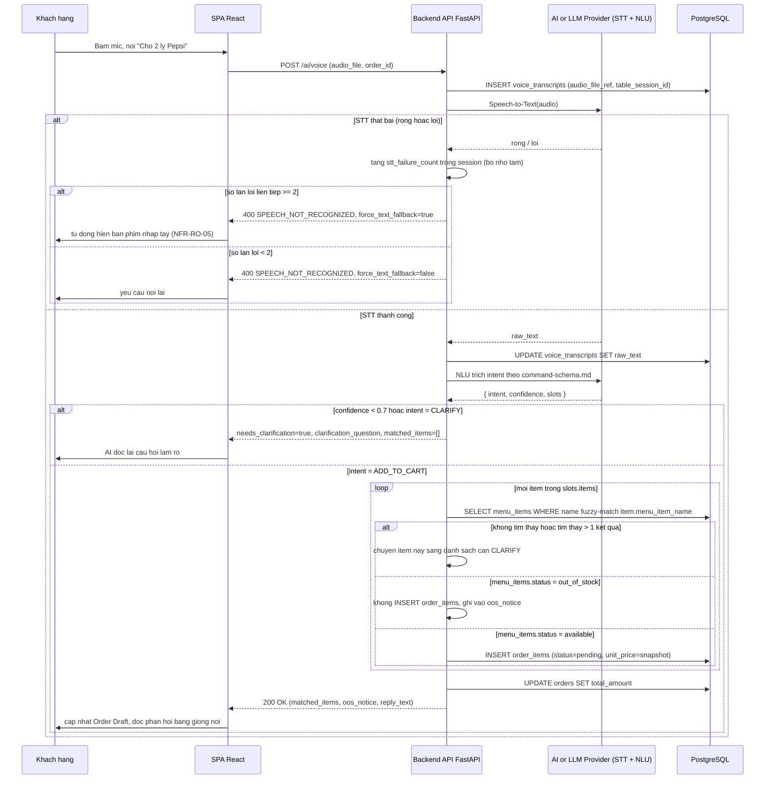

# Story Spec — US-02: Khách gọi món bằng AI Voice + kiểm tra Out of Stock (Output #22)

> Vai trò: Lead Engineer. Đây là User Story khó nhất trong backlog vì kết hợp 3 rủi ro kỹ thuật cùng lúc: nhận diện giọng nói không chắc chắn, tên món mơ hồ, và trạng thái Out of Stock có thể đổi ngay trong lúc khách đang nói. Tham chiếu: `vault/04-User-Stories/user-stories.md` (US-02), `vault/06-Engineering/command-schema.md`, `vault/06-Engineering/api-contract.md` (Mục 3–4), `vault/06-Engineering/architecture.md` (Mục 4–5), `vault/08-Decisions/decision-log.md` (ADR-001 gốc).

## 1. Phạm vi

**User Story:** *As a* Khách hàng, *I want* bấm nút Micro để đọc tên món ăn, *so that* AI phân tích và tự nhặt đúng món bỏ vào giỏ hàng.
**Acceptance Criteria liên quan:** US-02 AC1–AC4 (`user-stories.md`).
**Requirement IDs:** REQ-01, REQ-05, REQ-09, REQ-15, NFR-RO-02, NFR-RO-05.

## 2. Sequence Diagram (luồng đầy đủ, gồm nhánh lỗi)



## 3. Giải pháp chặn Out of Stock trong Order Draft (2 lớp)

Đây là điểm dễ sai nhất vì OOS có thể xảy ra ở **2 thời điểm khác nhau** — cần 2 cơ chế độc lập, không cái nào thay thế được cái kia:

**Lớp 1 — chặn tại thời điểm AI thêm món (mô tả ở Mục 2 trên):** nếu món đã là `out_of_stock` ngay lúc AI Gateway xử lý `ADD_TO_CART`, không `INSERT order_items` — chặn từ gốc, món không bao giờ vào giỏ. Đây là điểm khác với ADR-001 gốc (vốn mô tả tình huống món **đang nằm sẵn trong giỏ rồi mới chuyển OOS**).

**Lớp 2 — chặn khi món OOS xảy ra SAU khi đã có trong giỏ (đúng kịch bản ADR-001 gốc):**
1. Bếp/Manager gọi `POST /menu/items/{id}/out-of-stock` → backend publish `ITEM_OOS_BROADCAST` lên WS channel `menu:oos` VÀ `table:{table_session_id}` cho các bàn đang có món đó trong Order Draft (`architecture.md` Mục 4).
2. SPA nhận event, tự grayed-out món + disable nút Explicit Confirmation phía client (UX, không phải bảo mật).
3. **Chốt chặn cuối cùng, bắt buộc phía server** (không tin client): `POST /orders/confirm` phải re-check toàn bộ `order_items` của order — nếu còn bất kỳ item nào tham chiếu `menu_items.status = out_of_stock`, trả `400 ORDER_CONTAINS_OOS_ITEM` (`api-contract.md` Mục 1). Client bắt buộc phải gọi lại API xoá món đó rồi mới confirm lại được.

**Vì sao cần cả 2 lớp:** Lớp 1 ngăn AI tự thêm nhầm món đã hết ngay từ đầu (trải nghiệm tốt hơn — khách không phải tự gỡ). Lớp 2 xử lý race condition thời gian thực (món hết SAU khi đã thêm) — không có Lớp 1 thì Lớp 2 vẫn đủ đúng nghiệp vụ, nhưng thiếu Lớp 1 sẽ tạo trải nghiệm dở (khách phải tự dọn giỏ hàng).

## 4. Cơ chế Fallback STT (NFR-RO-05)

- **Đếm lỗi theo session, không theo global:** `stt_failure_count` gắn với `table_session_id`, reset về 0 khi có 1 lần STT thành công hoặc khi session đóng.
- **Ngưỡng:** đúng 2 lần lỗi liên tiếp (rỗng hoặc exception từ AI Provider) → response trả thêm field `force_text_fallback: true` để SPA tự động chuyển sang bàn phím nhập tay, không chờ khách tự bấm.
- **Không tính là lỗi liên tiếp nếu xen giữa có 1 lần thành công:** ví dụ lỗi → thành công → lỗi = vẫn chỉ tính 1 lỗi liên tiếp gần nhất tại thời điểm đó.
- **100% luồng gọi món vẫn phải nhập tay được** (NFR-RO-05) — nghĩa là `POST /ai/chat` (text) luôn khả dụng song song `POST /ai/voice`, không phụ thuộc trạng thái fallback của voice.

## 5. Kế hoạch Unit Test (pytest)

Dùng `pytest` + `pytest-asyncio` + FastAPI `AsyncClient` (httpx), mock AI/LLM Provider qua `dependency_overrides`, dùng DB test riêng (SQLite in-memory hoặc schema Postgres test qua `compose.yaml`).

```python
# backend/tests/test_ai_voice.py
import pytest
from httpx import AsyncClient

pytestmark = pytest.mark.asyncio


async def test_add_available_item_success(client: AsyncClient, mock_stt_success, seed_menu_available):
    """GIVEN món Pepsi đang available, WHEN AI nhận ADD_TO_CART, THEN order_items được insert."""
    resp = await client.post("/ai/voice", files={"audio_file": (...)}, data={"order_id": "..."})
    assert resp.status_code == 200
    body = resp.json()
    assert body["needs_clarification"] is False
    assert body["matched_items"][0]["name"] == "Pepsi"


async def test_add_out_of_stock_item_blocked(client: AsyncClient, mock_stt_success, seed_menu_oos):
    """GIVEN món Bò Lúc Lắc đang out_of_stock, WHEN ADD_TO_CART, THEN không insert order_items, trả oos_notice."""
    resp = await client.post("/ai/voice", files={"audio_file": (...)}, data={"order_id": "..."})
    body = resp.json()
    assert body["matched_items"] == []
    assert "Bò Lúc Lắc" in [i["name"] for i in body["oos_notice"]]


async def test_ambiguous_term_triggers_clarify(client: AsyncClient, mock_stt_ambiguous, seed_menu_multiple_bo):
    """GIVEN khách nói 'Bò' và menu có 3 món Bò, WHEN NLU trả nhiều candidate, THEN needs_clarification=True."""
    resp = await client.post("/ai/voice", files={"audio_file": (...)}, data={"order_id": "..."})
    body = resp.json()
    assert body["needs_clarification"] is True
    assert len(body["clarification_question"]) > 0


async def test_low_confidence_forces_clarify(client: AsyncClient, mock_nlu_low_confidence):
    """GIVEN NLU trả confidence 0.4 cho intent ADD_TO_CART, WHEN xử lý, THEN AI Gateway ép về CLARIFY."""
    resp = await client.post("/ai/chat", json={"message": "ừm cái gì đó", "order_id": "..."})
    body = resp.json()
    assert body["needs_clarification"] is True


async def test_stt_empty_first_attempt_no_fallback(client: AsyncClient, mock_stt_empty):
    """GIVEN lần đầu STT rỗng, WHEN gọi /ai/voice, THEN force_text_fallback=False."""
    resp = await client.post("/ai/voice", files={"audio_file": (...)}, data={"order_id": "..."})
    assert resp.status_code == 400
    assert resp.json()["force_text_fallback"] is False


async def test_stt_empty_second_attempt_triggers_fallback(client: AsyncClient, mock_stt_empty, session_with_one_prior_failure):
    """GIVEN đã có 1 lần lỗi trước đó trong session, WHEN lỗi lần 2 liên tiếp, THEN force_text_fallback=True (NFR-RO-05)."""
    resp = await client.post("/ai/voice", files={"audio_file": (...)}, data={"order_id": "..."})
    assert resp.json()["force_text_fallback"] is True


async def test_orders_confirm_blocked_when_draft_contains_oos_item(client: AsyncClient, seed_order_with_oos_item):
    """GIVEN Order Draft còn 1 item đã chuyển out_of_stock, WHEN POST /orders/confirm, THEN 400 ORDER_CONTAINS_OOS_ITEM."""
    resp = await client.post("/orders/confirm", json={"order_id": "...", "expected_total_amount": 100000})
    assert resp.status_code == 400
    assert resp.json()["error_code"] == "ORDER_CONTAINS_OOS_ITEM"


async def test_orders_confirm_success_creates_kitchen_tickets(client: AsyncClient, seed_order_all_available):
    """GIVEN Order Draft toàn món available, WHEN confirm, THEN tạo đủ kitchen_tickets cho từng order_item."""
    resp = await client.post("/orders/confirm", json={"order_id": "...", "expected_total_amount": 100000})
    body = resp.json()
    assert resp.status_code == 200
    assert len(body["kitchen_tickets"]) == 2  # seed_order_all_available tao san 2 order_items


async def test_voice_transcript_hard_deleted_on_session_close(db_session, seed_closed_table_session_with_transcript):
    """GIVEN table_session chuyển status=closed, WHEN trigger DB chạy, THEN voice_transcripts của session đó bị xoá cứng (NFR-RO-02)."""
    remaining = await db_session.execute(
        "SELECT count(*) FROM voice_transcripts WHERE table_session_id = :sid",
        {"sid": "..."},
    )
    assert remaining.scalar() == 0
```

**Ghi chú độ phủ:** 9 test case trên phủ đủ 3 rủi ro nêu ở Mục 1 (STT không chắc chắn, tên món mơ hồ, OOS race condition) cộng thêm 1 test xác nhận cơ chế hard-delete NFR-RO-02 (`data-model.md` Mục 4) — không test riêng WebSocket broadcast ở đây vì thuộc phạm vi integration test (Playwright, xem `frontend/e2e/`), không phải unit test backend.
